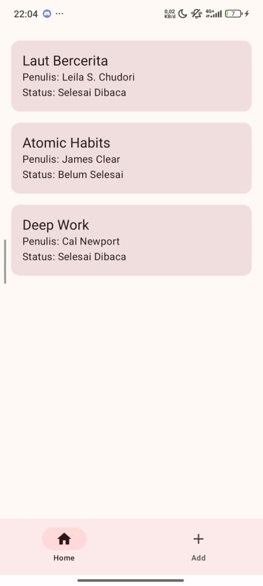
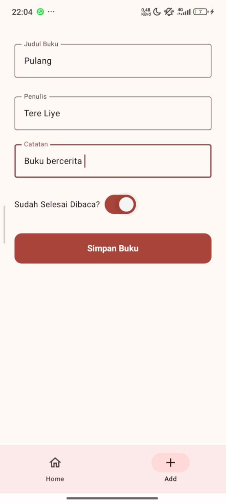

Proyek ini merupakan implementasi dari tugas **"Implementasi Pola Navigasi & Passing Data"** menggunakan **Jetpack Compose** di Android Studio.
Aplikasi ini menerapkan pola **Bottom Navigation** untuk mengelola dua layar utama (daftar buku dan tambah buku) dan mengirimkan data objek antar-screen menggunakan anotasi `@Serializable`.

---

## 🎯 Tujuan

* Menerapkan salah satu pola navigasi lanjutan yaitu **Bottom Navigation**.
* Mengirimkan data objek (`Book`) dari satu screen ke screen lainnya menggunakan **Kotlinx Serialization** (`@Serializable`).
* Memahami struktur aplikasi multi-screen (Home, Add, Detail) di Jetpack Compose.

---

## ✨ Fitur Utama

* ✅ Menampilkan daftar buku statis menggunakan `LazyColumn`.
* ✅ Menambah entri buku baru melalui formulir input.
* ✅ Navigasi antar layar utama (`Home`, `Add`) menggunakan Bottom Navigation Bar.
* ✅ Mengirim data objek `Book` antar layar (`Home` -> `Detail`, `Add` -> `Detail`) menggunakan `kotlinx-serialization` untuk konversi JSON.
* ✅ Menampilkan data buku yang diterima di layar detail.

---

## 💻 Teknologi yang Digunakan

* Kotlin
* Jetpack Compose
* Android Studio
* Navigation Compose
* Kotlinx Serialization

---

## 🚀 Instalasi & Cara Menjalankan

**Langkah-langkah:**

1.  **Clone repositori ini:**
    ```bash
    git clone [https://github.com/ysrednina0/BottomNavigation.git](https://github.com/ysrednina0/BottomNavigation.git)
    ```
2.  **Buka Proyek:**
    Buka Android Studio, pilih "Open", dan arahkan ke folder proyek yang baru saja Anda clone.
3.  **Sync Gradle:**
    Tunggu hingga Android Studio selesai mengunduh *dependencies* dan melakukan *sync* Gradle.
4.  **Jalankan Aplikasi:**
    Pilih emulator atau hubungkan perangkat fisik Anda, lalu tekan tombol "Run" (▶) di Android Studio.

---

## 💻 Teknologi & Ketergantungan (Dependencies)

Proyek ini dibangun menggunakan **Kotlin** dan **Jetpack Compose**. Ketergantungan utama meliputi:

* **`androidx.compose.material3`**: Untuk komponen UI Material Design 3 (Scaffold, Button, OutlinedTextField, dll.).
* **`androidx.navigation:navigation-compose`**: Untuk mengelola alur navigasi antar *composable screen*.
* **`org.jetbrains.kotlinx:kotlinx-serialization-json`**: Untuk serialisasi dan deserialisasi objek `Book` menjadi/dari string JSON saat dikirim antar layar.
* **`androidx.activity:activity-compose`**: Untuk integrasi Compose dengan Activity.

---

## 🗺️ Pola Navigasi: Bottom Navigation

Aplikasi ini menggunakan **Bottom Navigation** sebagai pola navigasi utama untuk berpindah antar dua layar utama: `HomeScreen` dan `AddBookScreen`.
Menu navigasi (didefinisikan di `TabView.kt`) ditampilkan di bagian bawah aplikasi dan menampilkan indikator aktif sesuai screen yang sedang dibuka.

---

## 📦 Mekanisme Pengiriman Data antar Screen

Aplikasi ini mengirim data objek `Book` ke `DetailScreen` dari **dua alur berbeda**:

### Alur 1: Dari `AddBookScreen` ke `DetailScreen`

1.  Pengguna menginput data (Judul, Penulis, Catatan, dan Status) di `AddBookScreen`.
2.  Saat tombol "Simpan Buku" ditekan, data tersebut dibungkus ke dalam objek `Book` baru yang diberi anotasi `@Serializable`.
3.  Objek `Book` dikonversi menjadi string JSON menggunakan `Json.encodeToString()`.
4.  String JSON dikirim ke `DetailScreen` sebagai argumen navigasi melalui *route*.
5.  Di `DetailScreen`, data JSON diekstrak dari argumen dan diubah kembali ke objek `Book` dengan `Json.decodeFromString()`.
6.  Data buku baru tersebut ditampilkan di tampilan detail.

### Alur 2: Dari `HomeScreen` ke `DetailScreen`

1.  Pengguna menekan salah satu item buku dari daftar (`LazyColumn`) di `HomeScreen`.
2.  Objek `Book` yang ada (dari item yang diklik) dikonversi menjadi string JSON.
3.  String JSON ini kemudian dikirim ke `DetailScreen` melalui *route* navigasi, sama seperti alur pertama.
4.  `DetailScreen` menerima JSON, mengubahnya kembali menjadi objek `Book`, dan menampilkannya.

## ➡️ Alur Aplikasi

1.  Aplikasi terbuka dengan dua tab di Bottom Navigation: "Home" dan "Add".
2.  **Tab Home (`HomeScreen`):** Menampilkan daftar buku yang sudah ada. Menekan salah satu buku akan membawa pengguna ke `DetailScreen`, menampilkan data buku tersebut.
3.  **Tab Add (`AddBookScreen`):** Menampilkan formulir untuk menambah buku baru.
4.  Setelah mengisi form dan menekan "Simpan Buku" → aplikasi berpindah ke `DetailScreen`, menampilkan data buku yang baru saja dibuat.
5.  **`DetailScreen`:** Menampilkan detail `Book` (judul, penulis, status, catatan) yang diterimanya. Terdapat tombol "Back" untuk kembali ke layar sebelumnya (Home atau Add).

---

## 📸 Screenshot Aplikasi

|      HomeScreen (Daftar Buku)       | AddBookScreen (Tambah Buku) | DetailScreen (Detail Buku) |
|:-----------------------------------:| :---: | :---: |
|  |  |  |
|        Tampilan daftar buku         | Tampilan form tambah buku | Tampilan detail buku |

---

## 👥 Anggota Kelompok

| Nama | NIM |
| :--- | :--- |
| Anindya Putri Aisyah | (23523136) |
| Nur Astrid Damayanti | (23523251) |